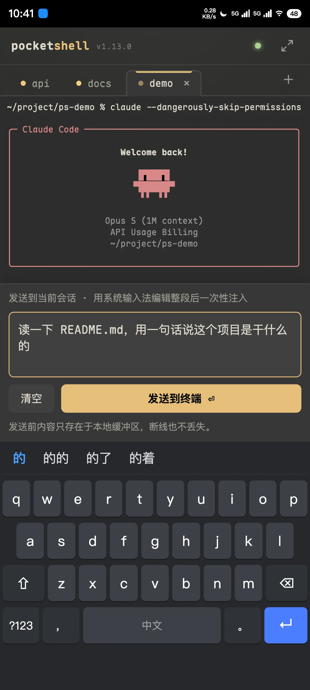
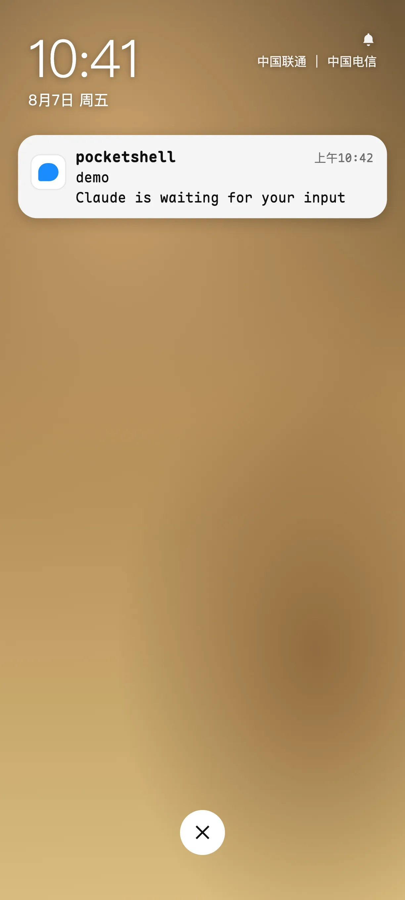
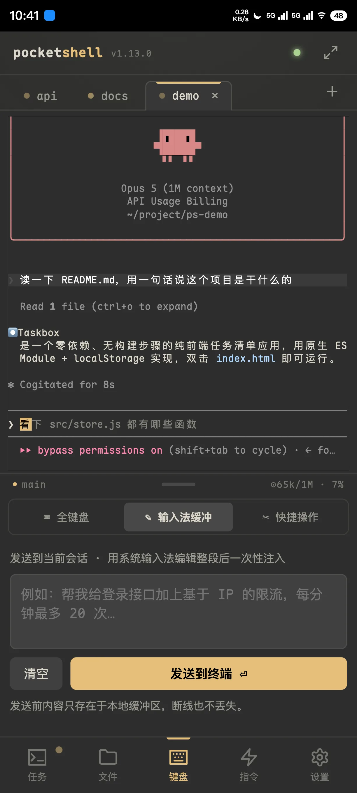
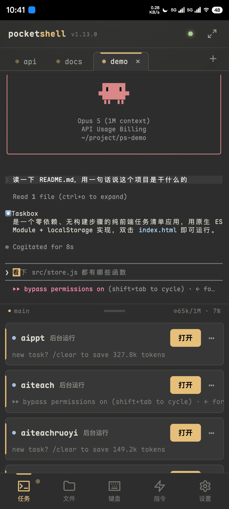
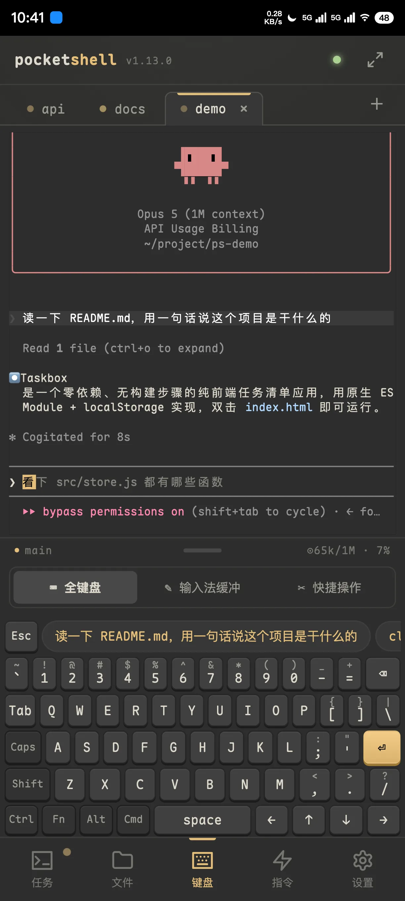
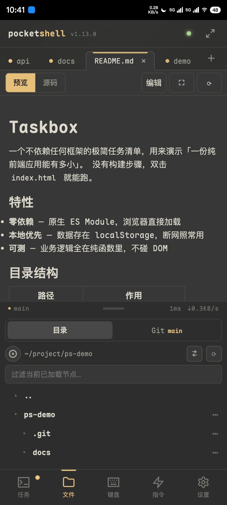

<div align="center">

# 📱 PocketShell

**在手机上跑 Claude Code —— 断网任务不停，重连自动补齐输出**

[](./LICENSE) [](https://github.com/Big-Pony/pocketshell/releases) [](https://github.com/Big-Pony/pocketshell/stargazers) 

[**在线演示**](https://demo.pocketshell.net) • [快速开始](#-快速开始) • [功能特性](#-功能特性) • [部署](#-部署) • [交互速查表](./USAGE-CN.md)

**Language**: 中文 | [English](./README.md)

### 🎮 [立刻试试 → demo.pocketshell.net](https://demo.pocketshell.net)

真的前端，假的后端 —— 不用装、不用配，手机上体验最佳。
敲个 `claude`，再点 **「试试断网」**，看断开期间的输出如何在重连后补齐。

</div>

## 📸 截图

<div align="center">

<table>
  <tr>
    <td align="center">
      <a href="assets/screenshots/01-launch-task-v2.webp"></a><br/>
      <sub>① 整段派活</sub>
    </td>
    <td align="center">
      <a href="assets/screenshots/03-push-notification-v2.webp"></a><br/>
      <sub>② 锁屏推送叫你</sub>
    </td>
    <td align="center">
      <a href="assets/screenshots/04-task-done-git-v2.webp"></a><br/>
      <sub>③ 回来输出已补齐</sub>
    </td>
  </tr>
  <tr>
    <td align="center">
      <a href="assets/screenshots/06-task-panel-v2.webp"></a><br/>
      <sub>④ 下半部：三态任务面板</sub>
    </td>
    <td align="center">
      <a href="assets/screenshots/07-keyboard-full-v2.webp"></a><br/>
      <sub>⑤ 自定义全键盘</sub>
    </td>
    <td align="center">
      <a href="assets/screenshots/10-markdown-preview-v2.webp"></a><br/>
      <sub>⑥ 文件预览与 Git</sub>
    </td>
  </tr>
</table>

<em>更多界面截图见 <a href="./USAGE-CN.md">交互速查表</a></em>

</div>

---

## 💡 这是什么

PocketShell 是一个**面向移动端的自托管远程终端**。它把开发机上的终端会话搬进手机浏览器，让你随时随地用手机跑任意 **CLI/TUI 编程 agent**（Claude Code、Codex、opencode、Kimi CLI……）或普通 shell/vim/htop。

**核心卖点是断线续跑 + 重放**：手机连开发机跑 agent，中途断网，服务端任务不停；重连后终端画面、滚动历史、会话状态自动补齐一致。agent 跑完或需要你输入时，还会推送通知到手机。

一个二进制 = 完整产品：前端内嵌、同端口 serve、端到端加密，在没装 Bun 的干净机器上下载即用。

| | |
|---|---|
| ✅ **适合** | 有一台常开的 Linux / macOS 开发机；想在通勤、床上、排队时派活给 AI；在意断网后任务是否还在跑 |
| ❌ **不适合** | 想要零配置的云端服务（这是自托管，需要你自己有机器和域名）；想在手机上写大段代码（它是终端，不是 IDE）；Windows 主机（暂不支持） |

## ✨ 功能特性

### 🖥 终端与会话

- **多会话终端**：列出机器上所有 tmux 会话（含非本 App 创建的），可接管、重命名、终止
- **任务面板**：三态点（运行中 / 等待输入 / 后台）+ 每个会话的最后一行预览
- **断线续跑**：心跳双信号判离线、指数退避重连，断线期间任务在服务端照常跑
- **精确重放**：按会话 `lastSeq` 记账，重连只补缺口，不重发已收到的输出
- **TUI 适配**：经典渲染器切换、alt-screen scrollback 归一，长输出无上限滚动，输入行常驻底部
- **轻量 Shell 会话**：隔离的 raw PTY，随手跑一条命令，不进任务面板

### ⌨ 手机输入

- **自定义全键盘**：默认的「经典」键位是完整笔记本布局，F1–F12、方向键、修饰键三态 sticky
- **键位三选一**：经典（默认、一字未变）/ 分层 / 上滑，在设置最上面切换。后两套把字母键触控面积翻倍——「分层」把数字符号收进第二层，「上滑」标在键帽角上（上下滑取用）。注意这两套没有 `Fn` / `Cmd` 键，所以下面的应用快捷层仅「经典」可用
- **输入法整段发送**：用系统输入法写完一整段需求再一次性注入，断线也不丢缓冲
- **智能命令提示条**：按前缀联想，点一下补全
- **Fn 应用快捷层**（经典键位）：切标签、滚屏、新建会话、全屏、重命名，全部走组合键
- **快捷操作面板**：方向盘布局，`Esc`/`Tab`/`Del`/`Home`/`End` 与复制粘贴一屏可达
- **快捷指令**：自定义常用命令，点击插入，多设备广播同步

### 📁 文件、预览与 Git

- **文件树**：懒加载目录树，行内显示 git 状态标记（`M`/`A`/`D`/`?`）
- **代码编辑**：CodeMirror 6，行号、查找替换、原生输入法、自动折行，分块保存 + 基于 mtime 的防误覆盖
- **文件预览**：图片 / Markdown 渲染 / 视频（支持拖动进度条）/ 静态 HTML（sandbox iframe，可跑 JS 与相对资源）
- **Git 面板**：工作区 diff 可视化，只读 log / 分支 / status，分支行一键刷新
- **上传下载**：多文件带进度、目录打包 zip、分块传输，弱网下按排队字节动态放宽超时

### 🔔 通知与安全

- **推送通知**：agent 跑完一轮或等待输入时推到手机，App 没开、锁屏、看别的会话都能收
- **四家工具接入**：Claude Code / Codex / opencode / Kimi CLI，设置里各自独立开关
- **出站 Webhook**：企微 / 飞书（可选签名）/ Slack / Discord 内置模板，也支持自定义 URL + JSON
- **智能免打扰**：正盯着该会话时不弹系统通知；短时间内重复完成合并为一条
- **端到端加密**：每次连接做完整 Noise **IK** 握手（双向身份认证 + 前向保密），未登记设备握手就过不了
- **设备管理**：一次性配对码、设备注册表持久化、命令行一键吊销（几秒内踢线并清推送订阅）

### 📱 App 体验

- **移动外壳**：上下双区 + 可拖分割条（双击全屏），底栏 5-tab，布局状态持久化
- **上下文用量**：跑 AI 时分割条显示当前会话的上下文占用（如 `⊙ 142k/1M · 14%`）
- **7 套主题**：深色 6 套（奶油深 / Gruvbox 深 / 东京夜 / 北欧极夜 / 摩卡 / 熄屏黑）+ 浅色 1 套（奶油浅）；终端的 ANSI 配色、光标、选区也跟着主题走，把任意 `.ghostty` 配色丢进 agent 的 `~/.pocketshell/themes/`（或在设置里粘贴导入）就会出现在列表里，清缓存、升级都不丢
- **5 套等宽字体**：Maple Mono（默认）/ JetBrains Mono / Google Sans Code / Monaspace Neon / Ubuntu Mono，都带终端画框字符与 Powerline 字形，设置里切换、整个界面生效（中文仍由系统字体渲染）
- **中英双语**：全量 UI 走 i18n，首开跟随浏览器语言，设置里可切换
- **PWA**：可「安装到主屏幕」standalone 启动；静态资源按版本分桶缓存，版本一变整桶丢弃
- **零依赖分发**：单文件二进制，加密走纯 JS 无原生 addon，一台 Mac 交叉编译出全平台

> 移动端手势与组合键详解见 **[交互速查表 USAGE-CN.md](./USAGE-CN.md)**。

## 🚀 快速开始

> 想先看看再装？[**demo.pocketshell.net**](https://demo.pocketshell.net) 跑的是真实前端 + 模拟 agent，
> 不用注册，也不需要一台常开的机器。

**环境要求**：开发机（跑 Agent 的一端）需要 `tmux` 和 `git`。

> 命令行安装过程的提示与报错是**英文**的（App 界面本身完整支持中文）。下面每一步都写清了会发生什么，照做即可。

**第一步：一行安装**

```bash
curl -fsSL https://raw.githubusercontent.com/Big-Pony/pocketshell/main/install.sh | sh
```

脚本会探测平台、下载对应二进制、校验 SHA256 并装到 `/usr/local/bin`（或 `~/.local/bin`）。

**第二步：做成开机自启的服务**

```bash
# Linux
sudo pocketshell-agent install --advertise wss://your.domain --name 我的服务器

# macOS —— 不要加 sudo，LaunchAgent 属于用户域
pocketshell-agent install --advertise wss://your.domain --name 我的Mac
```

这条命令会写好 systemd/launchd 服务配置 → 开机自启 + 立刻启动 → **首次安装时把配对串直接打印出来**。

**第三步：手机配对**

手机浏览器打开访问地址 → 粘贴配对串 → 起个设备名，完成（配对串 TTL 300 秒）。之后该设备即受信，可「添加到主屏幕」当 App 用。

装成服务后配对串进的是日志，用 `sudo journalctl -u pocketshell -n 50`（Linux）查看；过期了不用重启服务，跑一次 `pocketshell-agent pair` 会打印新的，常驻 Agent 自动拾取。

<details>
<summary><b>install 子命令的参数说明</b></summary>

`--advertise` 是必填的，它决定配对串里写的是哪个地址——不填手机拿到也连不上。其余可选：

| 参数 | 默认 | 说明 |
|---|---|---|
| `--name` | — | 实例名，装多台时用来区分 |
| `--user` | sudo 的发起者 | 服务以哪个用户身份运行 |
| `--host` | `127.0.0.1` | 绑定地址，手机直连局域网填 `0.0.0.0` |
| `--port` | `8722` | 监听端口 |

改参数或换版本直接重跑同一条命令：原配置会先备份，**密钥目录不动，已配对的手机不受影响**（因此重装时不会再打印配对串——要加新手机跑 `pocketshell-agent pair`）。

想指定版本：`VERSION=1.5.0 curl -fsSL … | sh`。卸载：`pocketshell-agent uninstall`（停服务、删配置，保留密钥目录与二进制）。

</details>

<details>
<summary><b>其他安装方式（源码运行 / 手动下载 / 自行构建）</b></summary>

**源码运行（开发用）**

```bash
# 1) 后端 Agent（需 tmux）
cd agent && bun install && bun run start

# 2) 前端（另开终端）
cd app && bun install && bun run dev      # http://localhost:5173
```

**手动下载二进制**

从 [Releases](https://github.com/Big-Pony/pocketshell/releases) 下载对应平台的压缩包（`linux-x64` / `linux-arm64` / `darwin-arm64` / `darwin-x64`），解压后运行：

```bash
tar -xzf pocketshell-agent-linux-x64.tar.gz
./pocketshell-agent-linux-x64
```

可选：用同一 Release 附带的 `SHA256SUMS.txt` 校验完整性（`shasum -a 256 -c SHA256SUMS.txt`）。目标机只需 `tmux`。macOS 首次运行若被 Gatekeeper 拦截，在「系统设置 → 隐私与安全性」放行即可。

> 这样直接跑是**前台进程**：Ctrl+C 或关掉 SSH 就停了，开机也不会自动起来。长期运行请用上面的 `install` 子命令，或参照 [部署指南 § 常驻运行](./DEPLOYMENT-CN.md#常驻运行systemd--launchd) 手工配置。

**从源码构建二进制**

```bash
# 先构建前端产物（Agent 会内嵌同端口 serve）
cd app && bun install && bun run build
# 再产出全平台单文件二进制
cd ../agent && bun install && bun run build:bin
```

把对应平台的二进制拷到目标机运行即可（目标机只需 `tmux`），构建需要 [Bun](https://bun.sh) ≥ 1.3。

</details>

<details>
<summary><b>访问地址、端口与常用环境变量</b></summary>

Agent 默认监听 **`8722` 端口**，启动后在运行 Agent 的机器上打开 `http://127.0.0.1:8722` 即可访问。注意默认只绑定 `127.0.0.1`——手机要从局域网/公网访问，需设置 `POCKETSHELL_HOST=0.0.0.0` 并配好 `POCKETSHELL_ADVERTISE`，或经反向代理暴露，见[部署指南](./DEPLOYMENT-CN.md)。

配置优先级：env > `<keyDir>/agent.json` > 默认值（见 `agent/src/config.ts`）。

| 变量 | 默认 | 说明 |
|---|---|---|
| `POCKETSHELL_HOST` | `127.0.0.1` | 绑定地址 |
| `POCKETSHELL_PORT` | `8722` | 端口 |
| `POCKETSHELL_ADVERTISE` | — | 写进配对串的对外地址 |
| `POCKETSHELL_KEY_DIR` | `~/.pocketshell` | 密钥 / 设备 / 审计目录 |
| `POCKETSHELL_TLS` / `_CERT` / `_KEY` | `0` | Agent 内置 TLS（手供证书） |
| `POCKETSHELL_UPDATE_REPO` | `Big-Pony/pocketshell` | 检查更新的 Release 来源 |
| `POCKETSHELL_INSTANCE_NAME` | — | 实例名，装多台时用来区分 |

**装多台服务器**：在多台机器上各装一个 Agent 天然支持，它们互不知晓、各自独立（各自的密钥、会话、推送订阅）。给每台设一个 `POCKETSHELL_INSTANCE_NAME`，名字会出现在手机桌面图标下、PWA 应用名和 App 顶栏，于是你得到两个能一眼分清的独立 PWA，**两台的通知都能收到、互不顶替**。详见[部署指南](./DEPLOYMENT-CN.md)。

</details>

## 🔒 安全

每次连接做 Noise IK 握手，双向身份认证 + 前向保密，未登记设备握手就过不了；穿透/反代链路只是传输密文，解不开明文。加密密钥仅存于 `KEY_DIR`，从不入库。

**认证边界即安全边界**——过握手 + 配对的设备可浏览 Agent 进程权限内的文件（不做额外沙箱），请以进程权限约束访问面。生产环境建议把 TLS 交给边缘（Cloudflare / Caddy）终结。

设备管理走命令行，在跑 Agent 的机器上执行：

```bash
pocketshell-agent pair [--name <设备名>]        # 生成配对串（TTL 300s）
pocketshell-agent devices list                  # 设备名、指纹、最近访问、IP
pocketshell-agent devices remove <指纹>         # 吊销设备（几秒内踢线）
```

> v1.8.0 移除了网页管理页（它在所有反向代理部署下都能从公网匿名访问）。**若你在 v1.7.x 或更早版本上跑过反向代理部署**，请排查 `<keyDir>/audit.log` 中有无你未触发的 `admin_pair_new` 事件，以及 `devices list` 里有无不认识的设备。详见 [部署指南 § 命令行设备管理](./DEPLOYMENT-CN.md#命令行设备管理)。

## 🔔 通知

Agent（Claude Code / Codex / opencode / Kimi CLI）完成一轮任务或等待你输入时，可以把通知推到手机上——即使 App 没开着、手机锁屏，或你正在看别的会话。

在**设置 → 通知**里按工具分别勾选，Agent 会幂等地往该工具配置里写一条 hook/notify（Claude Code → `~/.claude/settings.json`，Codex → `~/.codex/config.toml`，opencode → 插件目录）；取消勾选精确移除这一条，不影响你手写的其它配置。

两种送达方式可同时开：

- **Web Push** —— 需要在「已添加到主屏幕」的 PWA 里打开并授予通知权限。iOS 上必须先添加到主屏幕（Safari 标签页收不到）；国内 Android 若无 Google 服务框架，可能因连不上 FCM 而收不到。
- **出站 Webhook** —— 企微 / 飞书（可选签名密钥）/ Slack / Discord 内置模板，也支持自定义 URL + JSON 模板，可配多条并逐条测试。

> **隐私提示**：通知默认带一段 agent 输出摘要（可在设置里关掉）。Web Push 走浏览器标准加密通道，但 **Webhook 是把消息明文发给第三方服务商的**——如果摘要可能含敏感信息又配了 Webhook，请留意。

## 🌐 部署

需要从公网访问（不在同一局域网）？见 **[部署指南 DEPLOYMENT-CN.md](./DEPLOYMENT-CN.md)**，涵盖四种方式：

| 方式 | 适用场景 |
|---|---|
| 纯 IP + 端口 | 局域网内直连，无需域名 |
| Caddy / Nginx 反代 | 有公网 IP 的服务器 + 域名 |
| Cloudflare Tunnel | 家宽无公网 IP，不想开端口 |
| frp 中转 | 无公网 IP，但想自控整条链路 |

文档同时给出 systemd / launchd 常驻运行示例与排查表。

## 🔄 自动更新

Agent 内置基于 GitHub Releases 的应用内自动更新：启动时和手机每次连接时静默检查（结果缓存 6 小时，失败不影响使用）。有新版本时顶栏出现更新徽标，点「更新」即自动完成下载 → 校验 SHA256 →（macOS）重签名 → 替换二进制 → 重启，全程无需手动操作。

- `POCKETSHELL_UPDATE=0` 可关闭；`POCKETSHELL_UPDATE_REPO` 可指向自己 fork 的仓库（此时只检查、不自动替换二进制）。
- 自重启依赖进程被 systemd / launchd 托管；macOS 上首次授予的 Full Disk Access 在 OTA 后不会丢失。详见 [部署指南 § 自动更新（OTA）](./DEPLOYMENT-CN.md#自动更新ota)。

## 🛠 技术栈

| 层 | 选型 |
|---|---|
| 前端 | Svelte 5（runes）+ Vite 5 + [xterm.js](https://github.com/xtermjs/xterm.js)（WebGL 渲染）+ CodeMirror 6 + svelte-i18n |
| 后端 | [Bun](https://bun.sh) + TypeScript，同端口 serve 内嵌前端与 WebSocket |
| 会话 | tmux 托管 PTY —— 会话真身在服务端，App 只是它的一块屏幕 |
| 加密 | [noise-handshake](https://github.com/holepunchto/noise-handshake) Noise IK + 纯 JS `sodium-javascript`（无原生 addon） |
| 存储 | `bun:sqlite`（快捷指令）+ 原子写 JSON（密钥 / 设备 / 通知配置） |
| 分发 | `bun build --compile` 单文件二进制，一台 Mac 交叉编译 linux/darwin ×64/arm64 |
| 测试 | Vitest 2 + @testing-library/svelte（前端）· Bun test（后端）· agent-browse MCP（e2e） |

## 📦 版本

当前版本 **v1.13.0**（2026-08-06）· 完整更新日志见 [Releases](https://github.com/Big-Pony/pocketshell/releases)

**v1.13.0** —— 键盘键位三选一（经典 / 分层 / 上滑）并配一次性教程，在设置最上面切换；修复终端内容照常刷新却无法上翻；「上滑」键位新增下滑，补齐此前缺的 16 个符号。

**v1.12.0** —— 快捷操作面板重排；删除键改发退格而非前向删除；修复切换标签后终端历史被压缩到左侧一小块、重新载入历史后表格框线错位。

**v1.11.0** —— 内置 5 套等宽字体（默认改为 Maple Mono），作用于终端、预览与整个界面；设置 → 等宽字体。

## ⚡ 性能

面向移动弱网优化：PTY 输出按时间/字节合批 + 按订阅定向 fan-out + 背压丢帧回落；大 RPC 响应自动分片重组；断线 gap-aware 只补缺口；静态资源构建期预压缩（br/gz）+ ETag/304；隐藏终端停写、后台即 detach。

## 🤝 贡献

欢迎提交 Issue 和 Pull Request。

1. Fork 本仓库
2. 创建特性分支（`git checkout -b feat/your-feature`）
3. 提交更改（`git commit -m 'feat: your feature'`）
4. 推送分支（`git push origin feat/your-feature`）
5. 开启 Pull Request

改协议请先改后端 `agent/src/protocol.ts`，前端 `app/src/lib/protocol.ts` 是它的逐字镜像。前后端各自 `bun test` 与 `bun run typecheck` 需通过。

## 📄 许可证

[Apache-2.0](./LICENSE)

内置主题引用了 MIT 许可的第三方调色板，来源与许可见 [THIRD-PARTY-THEMES.md](./THIRD-PARTY-THEMES.md)。

## 🙏 致谢

- [xterm.js](https://github.com/xtermjs/xterm.js) —— 浏览器终端渲染
- [tmux](https://github.com/tmux/tmux) —— 服务端会话真身，断线续跑的基石
- [Bun](https://bun.sh) —— 运行时与单文件二进制编译
- [noise-handshake](https://github.com/holepunchto/noise-handshake) —— Noise IK 协议实现
- [CodeMirror](https://codemirror.net/) —— 移动端可用的代码编辑器

---

<div align="center">

**⭐ 如果这个项目对你有帮助，请给个 Star！**

</div>
