# PocketShell

[](./LICENSE)
[](https://github.com/Big-Pony/pocketshell/releases)
[](https://github.com/Big-Pony/pocketshell/stargazers)


**手机上跑 Claude Code：断网任务不停，重连画面自动补齐。**

面向 CLI/TUI 编程 agent（Claude Code / Codex / opencode）的自托管、端到端加密移动终端。随时在手机上发起并盯着长时间运行的 agent 任务；断网时任务在服务端继续跑，重连瞬间补齐全部输出——agent 跑完或需要你时还会推送通知到手机。

[English](./README.md) · **中文**

#### 一次完整的任务：从手机派活到看见成品

<p align="center">
  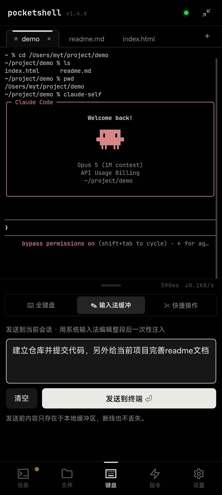
  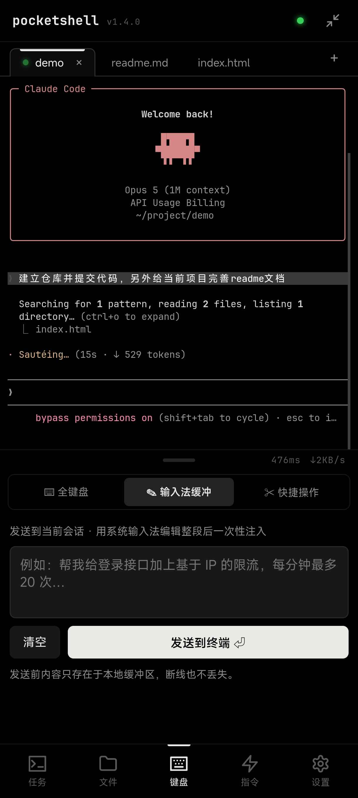
  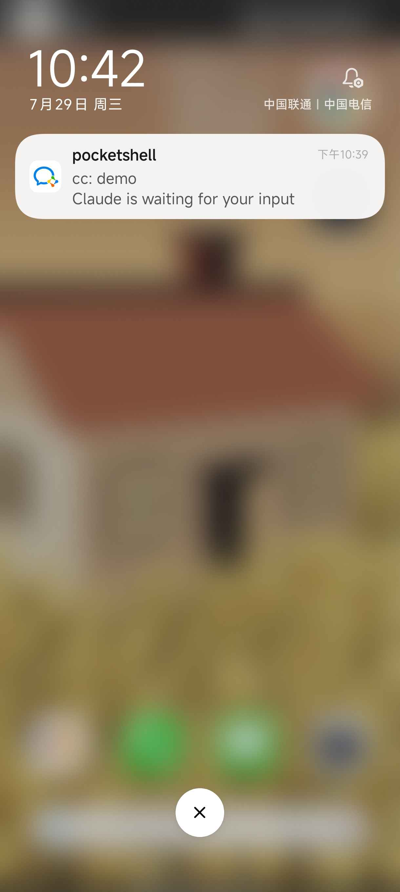
  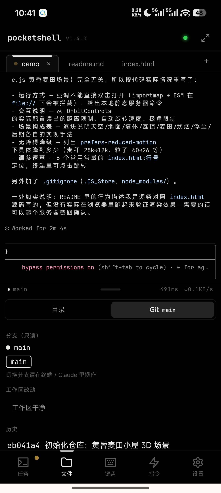
  
</p>

<p align="center"><em>① 用系统输入法写一整段中文需求，一次性注入 · ② 任务开始，可以熄屏走开 · ③ 跑完或需要你时推送把你叫回来 · ④ 回来时输出已补齐，代码也提交了 · ⑤ 成品直接在手机上全屏跑起来</em></p>

#### 多会话与断线保护

<p align="center">
  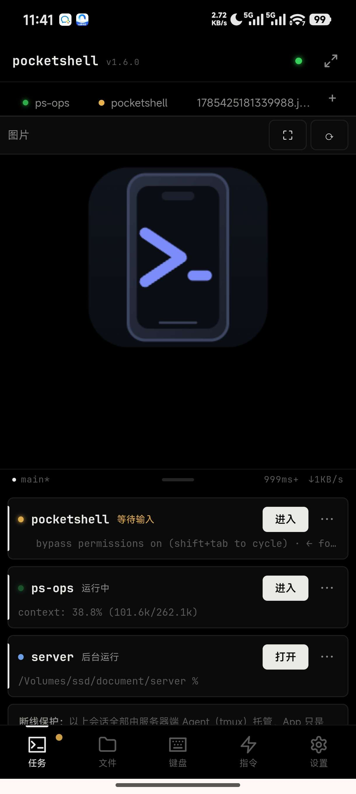
</p>

<p align="center"><em>主机上的每个 tmux 会话都在这里——运行中 / 等待输入 / 后台运行三态一目了然，还带最后一行预览。会话全部由服务端托管，App 只是它的一块屏幕。</em></p>

#### 自定义全键盘

<p align="center">
  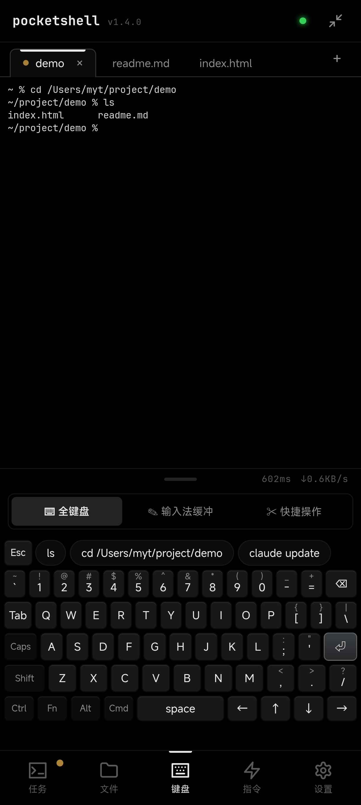
  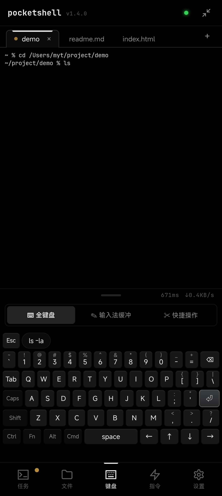
  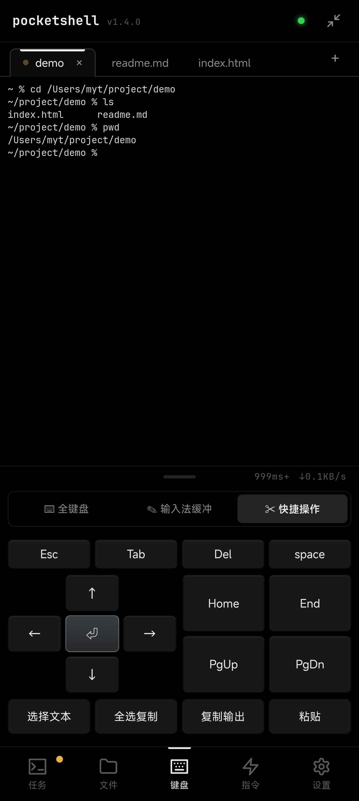
</p>

#### 文件、预览与 Git

<p align="center">
  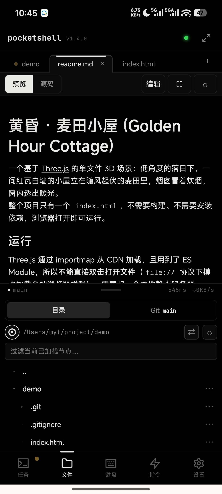
  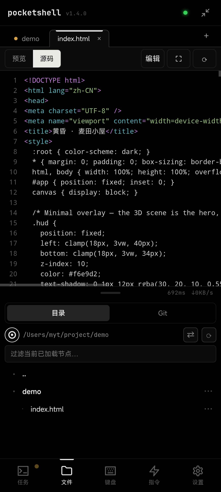
  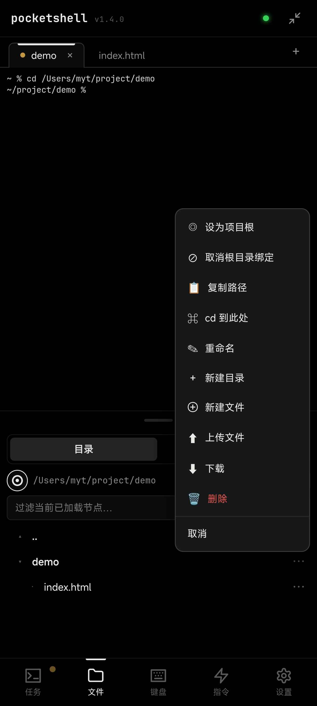
</p>

#### 指令、主题与通知

<p align="center">
  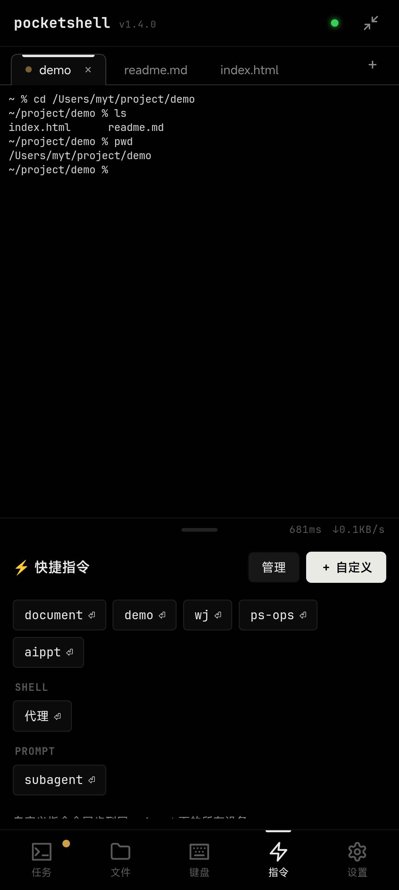
  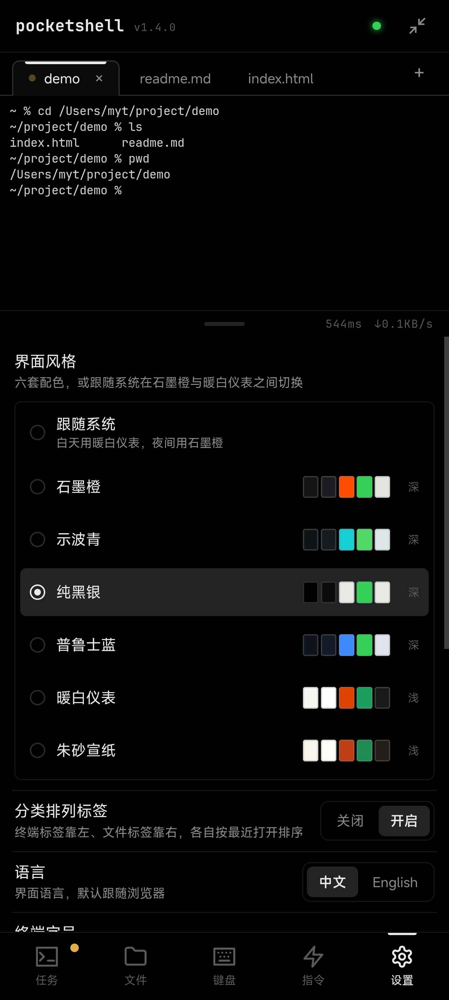
  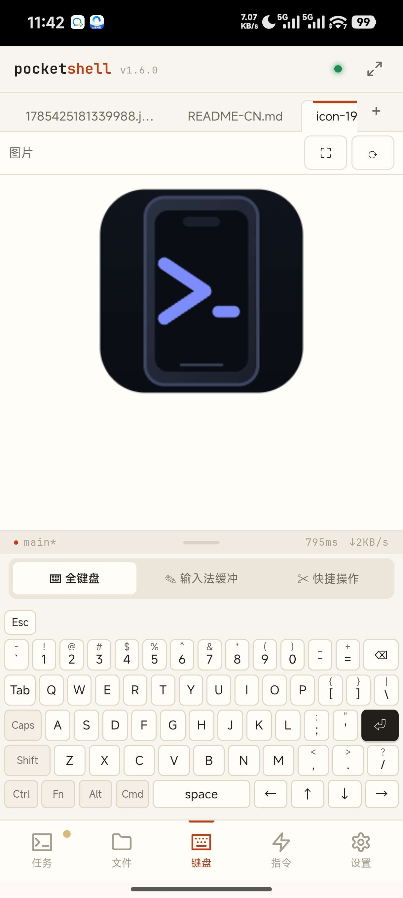
  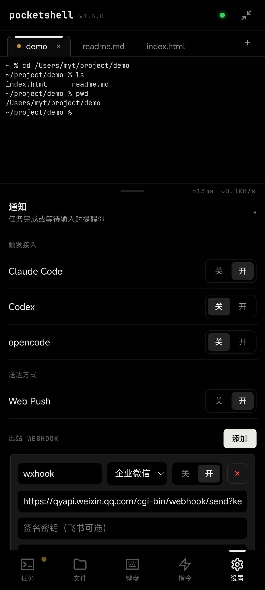
</p>

---

### 简介

PocketShell 是一个**面向移动端的自托管远程终端**。它把开发机上的终端会话搬到手机浏览器里，让你随时随地用手机跑任意 **CLI/TUI 编程 agent**（Claude Code、Codex、opencode……）或普通 shell/vim/htop。

一个二进制 = 完整产品：内嵌前端、同端口 serve、端到端加密，别人在没装 Bun 的干净机器上下载即用。

**核心卖点 — 断线续跑 + 重放**：手机连开发机跑 agent，中途断网，服务端任务不停；重连后终端画面、滚动历史、会话状态自动补齐一致。

### 功能特性

- **多会话终端 / 服务端 tmux 面板**：列出机器上所有 tmux 会话（含非本 App 创建的），支持接管、重命名、终止；三态点（运行/等待/完成）+ 最后一行预览；每会话持久终端实例。
- **断线续跑 + 重放**：心跳双信号判离线、指数退避重连；按会话 `lastSeq` 记账，重连自动补发缺口，gap 时下发 resync；断线期间输出照常入 replay，任务不停。
- **推送通知**：agent 跑完一轮或等待输入时，第一时间推到手机——App 没开、锁屏、看别的会话也能收（Web Push + 出站 Webhook：企微 / 飞书 / Slack / Discord）；智能免打扰：正看着该会话时不打扰。
- **端到端加密与设备安全**：每次连接做完整 Noise **IK** 握手（双向身份认证 + 前向保密）；信道内一次性配对码；设备注册表持久化，可命名 / 一键吊销（吊销即踢线）；固定窗口限速防爆破；结构化审计落盘。
- **自定义全键盘**：xterm 只读、输入统一经输入路由；完整笔记本布局（F1–F12 + 方向键 + 修饰键 sticky）；Fn 应用快捷层；系统输入法整段发送；键盘驱动选区/复制/粘贴；智能命令提示条（前缀联想、单击补全）。
- **快捷指令**：全部为你自己添加的自定义项，点击插入，增删改，多设备广播同步。
- **文件 + Git 面板**：惰性目录树 + 内联 git 标记；代码预览（高亮 + 行号），可切到编辑器编辑保存（CodeMirror 6，行号 / 搜索替换 / 系统输入法，分片保存 + 基于 mtime 的防误覆盖，新建文件直接进编辑器）；**文件预览：图片 / Markdown（渲染，含代码高亮与本地图片）/ 静态 HTML（sandbox iframe，可跑 JS + 相对资源），常驻头部栏 `预览｜源码｜编辑` + 刷新**；工作区 diff 可视化；只读 git log/分支/status；文件写操作（重命名/新建/删除强确认）；上传下载（多文件带进度、目录 zip、分片传输）。
- **移动外壳**：上下双区 + 可拖分割条（双击全屏）；底栏 5-tab；上区统一 tab 栏（终端 + 文件，可横向滚动）；打开状态持久化。
- **6 套主题**：深色 4 套（石墨橙 / 示波青 / 纯黑银 / 普鲁士蓝）+ 浅色 2 套（暖白仪表 / 朱砂宣纸），设置里切换，即时生效；可跟随系统明暗。
- **中英双语**：全量 UI 走 i18n，首开跟随浏览器语言，设置里可切换。
- **PWA**：手机 Chrome 可「安装应用」，standalone 启动；静态资源按版本分桶缓存，版本一变整桶丢弃，二次打开近乎零请求且永不吃到旧版本。
- **零依赖分发**：单文件二进制（`bun build --compile`，产 linux/darwin 多平台）；加密走纯 JS，无原生 addon；一台 Mac 可交叉编译出全平台。

> 对全屏 TUI agent 做了适配（如经典渲染器切换、alt-screen scrollback 归一），长输出可无上限滚动、输入行常驻底部。

### 交互速查表

移动端有不少手势与组合键并不直观，这里集中说明。下表「图标 / 按钮」列：图标按钮显示其图标，文本按钮显示文本。

**全键盘（⌨ 标签）**

| 图标位置 | 图标 / 按钮 | 功能描述 |
|---|---|---|
| 底行修饰键 | `Shift` `Ctrl` `Alt` `Cmd` `Fn` `Caps` | 点击三态循环：**点 1 下 = 一次性**（按下一个键后自动弹起）→ **再点 = 锁定**（常亮、持续生效）→ **第 3 下 = 关闭** |
| 任意字符键 | 长按 | 长按连发（持续重复输入该键） |
| 组合键 | `Ctrl` + 字母 | 发送控制字符：`Ctrl+C` 中断、`Ctrl+D` EOF、`Ctrl+Z` 挂起、`Ctrl+L` 清屏等 |
| 组合键 | `Alt` + 键 | 发送 Meta（ESC 前缀，即 `\x1b` + 字符） |
| 组合键 | `Shift` / `Caps` + 字母 | 转大写（两者异或：只按其一才大写，同时按则抵消） |
| 功能行 | 点亮 `Fn` 后 | 功能行由「命令提示条」切换为 `F1`–`F12` |
| 组合键 | `Fn` + `F1`–`F12` | 发送功能键 |
| 组合键 | `Fn` + `←` / `→` | 上一个 / 下一个标签页 |
| 组合键 | `Fn` + `↑` / `↓` | 终端向上 / 向下滚动 |
| 组合键 | `Fn` + `1`–`9` | 跳到第 N 个标签页 |
| 组合键 | `Fn` + `N` / `D` / `F` / `C` / `R` | 新建会话 / 退到后台 / 全屏切换 / 复制可见输出 / 重命名会话 |
| 组合键 | `Cmd` + `←` / `→` | 上一个 / 下一个标签页 |
| 组合键 | `Cmd` + `A` / `C` / `V` | 全选复制 / 智能复制（有选区复制选区，否则复制可见输出）/ 粘贴 |
| 组合键 | `Cmd` + `F` / `N` / `R` / `K` | 页面全屏 / 新建会话 / 重命名会话 / 清屏 |
| 功能行（`Fn` 关闭时） | 命令提示 chip | 智能命令联想，点一下补全 / 插入到输入行 |
| 键帽右上角 | 小字上档符 | 该键 `Shift` 后的字符 |

**输入法缓冲（✎ 标签）**

| 图标位置 | 图标 / 按钮 | 功能描述 |
|---|---|---|
| 输入区 | 文本框 | 用系统输入法编辑整段文字；发送前只存本地缓冲区，断线也不丢失 |
| 底部左 | `清空` | 清空缓冲区 |
| 底部右 | `发送到终端 ⏎` | 把整段内容注入终端并回车；**缓冲为空时点发送 = 只发一个回车**（免切回全键盘按 Enter） |

**快捷操作（✂ 标签）**

| 图标位置 | 图标 / 按钮 | 功能描述 |
|---|---|---|
| 顶部行 | `Esc` `Tab` `Del` | 发送对应按键 |
| 方向键盘中心 | `⏎` | 回车（确认） |
| 导航键 | `Home` `End` `PgUp` `PgDn` | 对应光标 / 翻页导航键 |
| 底部按钮 | `选择文本` | 进入复制模式覆盖层，长按手动选中终端文本 |
| 底部按钮 | `全选复制` | 全选当前终端内容并复制到剪贴板 |
| 底部按钮 | `复制输出` | 复制当前可见的终端输出 |
| 底部按钮 | `粘贴` | 把剪贴板内容粘贴到终端 |

**文件面板（目录标签）**

| 图标位置 | 图标 / 按钮 | 功能描述 |
|---|---|---|
| 路径栏左 | ◉（圆环锚点） | **单击**：把项目根设为当前聚焦终端的工作目录；**双击**：开 / 关「跟随聚焦终端」（跟随时终端 `cd` 到哪、根就跟到哪） |
| 路径栏中 | 路径文字 | 点击复制完整路径到剪贴板 |
| 路径栏右 | `⇄` | 切换项目根（弹出历史根目录列表） |
| 路径栏右 | `⟳` | 刷新目录（保留已展开的层级） |
| 目录树行前 | `▸` / `▾` / `·` | 目录折叠 / 目录展开 / 文件；点目录行展开，点文件行打开预览 |
| 目录树行尾 | `⋯` | 打开该项操作菜单（复制路径、cd、重命名、新建、上传、下载、删除等） |
| 目录树行内 | `M` `A` `D` `?` | git 状态标记：已修改 / 新增 / 删除 / 未跟踪 |
| 子标签栏 | `Git` 旁分支名 | 当前所在的 git 分支 |

**上区标签栏（终端 + 文件）**

| 位置 | 手势 | 功能描述 |
|---|---|---|
| 任意上区标签 | 单击 | 立即选中 / 切到该标签（无延迟） |
| 同一个上区标签 | 双击 | 弹出该标签的关闭确认弹窗 |
| ↳ 终端标签 | 确认后 | 仅关闭标签——tmux 会话仍在后台运行，可从任务面板重新打开 |
| ↳ Shell 标签 | 确认后 | 该 Shell 会话被关闭并销毁，无法恢复 |
| ↳ 文件标签 | 确认后 | 关闭该文件预览标签（若有未保存修改会先提示） |
| 标签栏右侧 | `+` | 新建 tmux 会话（弹窗输入名称） |

### 快速开始

**环境要求**
- 开发机（运行 Agent 的一端）：`tmux`、`git`。
- 构建：[Bun](https://bun.sh) ≥ 1.3。

**方式一：源码运行（开发/自用）**

```bash
# 1) 后端 Agent（需 tmux）
cd agent && bun install && bun run start

# 2) 前端（另开终端）
cd app && bun install && bun run dev      # http://localhost:5173
```

**方式二：一行安装（最快，推荐）**

```bash
curl -fsSL https://raw.githubusercontent.com/Big-Pony/pocketshell/main/install.sh | sh
```

脚本会探测平台、下载对应二进制、校验 SHA256 并装到 `/usr/local/bin`（或 `~/.local/bin`）。装完再跑一条命令做成开机自启的服务：

```bash
# Linux
sudo pocketshell-agent install --advertise wss://your.domain --name 我的服务器
# macOS —— 不要加 sudo，LaunchAgent 属于用户域
pocketshell-agent install --advertise wss://your.domain --name 我的Mac
```

这条命令会：写好 systemd/launchd 服务配置 → 开机自启 + 立刻启动 → **首次安装时把配对串直接打印出来**。手机打开访问地址粘贴即可。

`--advertise` 是必填的，它决定配对串里写的是哪个地址——不填手机拿到也连不上。其余可选：`--name` 实例名（装多台时区分）、`--user` 服务运行用户（默认为 sudo 的发起者）、`--host`（默认 `127.0.0.1`，手机直连局域网填 `0.0.0.0`）、`--port`（默认 `8722`）。

改参数或换版本直接重跑同一条命令即可：原配置会先备份，**密钥目录不动，已配对的手机不受影响**（因此重装时不会再打印配对串——要加新手机跑 `pocketshell-agent pair`）。

想指定版本：`VERSION=1.5.0 curl -fsSL … | sh`。卸载：`pocketshell-agent uninstall`（停服务、删配置，保留密钥目录与二进制）。

**方式三：手动下载二进制**

从 [Releases](https://github.com/Big-Pony/pocketshell/releases) 下载对应平台的压缩包（`linux-x64` / `linux-arm64` / `darwin-arm64` / `darwin-x64`），解压后运行：

```bash
tar -xzf pocketshell-agent-linux-x64.tar.gz
./pocketshell-agent-linux-x64
```

可选：用同一 Release 附带的 `SHA256SUMS.txt` 校验完整性（`shasum -a 256 -c SHA256SUMS.txt`）。目标机只需 `tmux`。macOS 首次运行若被 Gatekeeper 拦截，在「系统设置 → 隐私与安全性」放行即可。

> **这样直接跑是前台进程**：Ctrl+C 或关掉 SSH 就停了，开机也不会自动起来。长期运行请用上面的 `install` 子命令，或参照 [部署指南 § 常驻运行](./DEPLOYMENT-CN.md#常驻运行systemd--launchd) 手工配置。

**方式四：从源码构建二进制**

```bash
# 先构建前端产物（Agent 会内嵌同端口 serve）
cd app && bun install && bun run build
# 再产出全平台单文件二进制
cd ../agent && bun install && bun run build:bin
```

把对应平台的二进制拷到目标机运行即可（目标机只需 `tmux`）。

**访问地址与默认端口**

Agent 默认监听 **`8722` 端口**（`POCKETSHELL_PORT` 可改），启动后在运行 Agent 的机器上用浏览器打开 `http://127.0.0.1:8722` 即可访问 App。注意默认只绑定 `127.0.0.1`——手机要从局域网/公网访问，需设置 `POCKETSHELL_HOST=0.0.0.0` 并配好 `POCKETSHELL_ADVERTISE`，或经反向代理暴露，具体见 [部署指南](./DEPLOYMENT-CN.md)。

**首次配对**

Agent 首次运行会打印：App 访问地址、可粘贴的**配对串**、Agent 公钥。手机打开 App → 粘贴配对串完成一次性配对（默认 TTL 300s）。之后该设备即受信。

配成系统服务后这些输出进的是日志，用 `sudo journalctl -u pocketshell -n 50`（Linux）查看。配对码 TTL 300 秒且只在进程启动时生成一次——过期了不用重启服务，在 Agent 所在机器执行 `pocketshell-agent pair` 即可打印新的配对串，常驻的 Agent 会自动拾取。

**常用环境变量**（`agent/src/config.ts`，优先级 env > `<keyDir>/agent.json` > 默认）

| 变量 | 默认 | 说明 |
|---|---|---|
| `POCKETSHELL_HOST` | `127.0.0.1` | 绑定地址 |
| `POCKETSHELL_PORT` | `8722` | 端口 |
| `POCKETSHELL_ADVERTISE` | — | 写进配对串的对外地址 |
| `POCKETSHELL_KEY_DIR` | `~/.pocketshell` | 密钥/设备/审计目录 |
| `POCKETSHELL_TLS` / `_CERT` / `_KEY` | `0` | Agent 内置 TLS（手供证书） |
| `POCKETSHELL_UPDATE_REPO` | `Big-Pony/pocketshell` | 检查更新的 Release 来源；自动更新只从内置仓库应用 |
| `POCKETSHELL_INSTANCE_NAME` | — | 实例名，装多台时用来区分（见下节）；不设即显示默认的「PocketShell」 |

### 装多台服务器

在多台机器上各装一个 Agent 是**天然支持**的——它们互不知晓，各自独立：各自的密钥与设备注册表、各自的会话、各自的推送订阅。你要做的只是给每台一个自己的地址，再给它起个名字：

```bash
# 开发机
POCKETSHELL_ADVERTISE=wss://dev.example.com POCKETSHELL_INSTANCE_NAME=开发 pocketshell-agent
# 家里的服务器
POCKETSHELL_ADVERTISE=wss://home.example.com POCKETSHELL_INSTANCE_NAME=家里 pocketshell-agent
```

设了 `POCKETSHELL_INSTANCE_NAME` 后，这个名字会出现在三处：

- **手机桌面图标下的文字** —— 显示「开发」（只有实例名，因为这行字被系统截断得最狠）
- **安装 PWA 时的应用名** —— 显示「开发 · PocketShell」
- **App 顶栏** —— 品牌名前面加上「开发 ·」

于是手机上就是两个独立的 PWA、两个能一眼分清的桌面图标。因为浏览器按域名隔离数据，两边的标签页、项目根书签、推送订阅也各自独立——**两台的通知都能收到，互不顶替**（同一个域名下做不到这点，浏览器每个域名只允许一个推送订阅）。

> 前提是每台要有自己的域名或地址。手机上的 App 是 HTTPS 页面，浏览器不允许它连明文 `ws://`，而 `wss://` 需要证书、证书签不了裸 IP——所以公网访问的实例都需要一个域名（子域名即可，见[部署指南](./DEPLOYMENT-CN.md)）。局域网内直连 IP 则不受此限。

### 设备管理

设备管理走命令行，在跑 Agent 的那台机器上执行：

```bash
pocketshell-agent pair [--name <设备名>]        # 生成配对串（TTL 300s）
pocketshell-agent devices list                  # 设备名、指纹、最近访问、IP
pocketshell-agent devices remove <指纹>         # 吊销设备
```

`pair` 对常驻 Agent 直接生效，不用重启。`devices remove` 几秒内生效：常驻 Agent 会发现变更，撤销该设备的授权、断开它的在线连接、清掉它的推送订阅。

> **这里原本有一个网页管理页。** v1.7.5 删除，原因是它在所有反向代理部署下都能从公网访问。它唯一的凭证是「请求来自 `127.0.0.1`」这道检查——而同机反向代理（Caddy、Nginx、Cloudflare Tunnel、frp，也就是 [DEPLOYMENT-CN.md](./DEPLOYMENT-CN.md) 推荐的全部四种方式）正是从这个地址连进来的，于是**所有**请求都能通过，包括来自公网的匿名请求；此时 `POST /admin-api/pair` 会把可用的配对串交给任何调用者。该页面按设计只允许本机访问，也就是说它的受众一定有 shell——因此它能做的事上面的命令全都能做，删掉它是消除攻击面，而不是给它加锁。
>
> **如果你在 v1.7.4 或更早版本上跑过反向代理部署**，请排查是否被利用：看 `<keyDir>/audit.log` 里有没有你没触发过的 `admin_pair_new` 事件，以及 `pocketshell-agent devices list` 里有没有不认识的设备。`POCKETSHELL_ADMIN` 已不再被读取。

### 部署

需要从公网访问（不在同一局域网）？见 **[部署指南 DEPLOYMENT-CN.md](./DEPLOYMENT-CN.md)**，涵盖四种方式：纯 IP+端口直连、服务器直接部署（Caddy / Nginx 反代）、Cloudflare Tunnel（无公网 IP）、frp 中转服务器，以及 systemd / launchd 常驻运行示例。

### 自动更新

Agent 内置基于 GitHub Releases 的应用内自动更新：启动、以及手机端每次连接时静默检查新版本（结果缓存 6 小时，检查失败不影响正常使用）。有新版本时 App 顶栏品牌旁出现更新徽标，点击打开确认弹窗，点「更新」即自动完成下载、校验、（macOS 上）重签名、替换二进制、重启，全程无需手动操作二进制文件。

- 用 `POCKETSHELL_UPDATE=0` 关闭该功能；`POCKETSHELL_UPDATE_REPO` 可改指向自己 fork 的仓库，设为 `off` 效果等同关闭。
- 应用内更新完成后的自重启依赖进程被 systemd / launchd 等 supervisor 托管；macOS 上首次授予的 Full Disk Access 权限在 OTA 后不会丢失。细节见 **[部署指南 § 自动更新（OTA）](./DEPLOYMENT-CN.md#自动更新ota)**。

### 通知

Agent（Claude Code / Codex / opencode）完成一轮任务或等待你输入时，可以把通知推到手机上——即使 App 没开着、手机锁屏，或你正在看别的会话。

**开启方式**：设置 → 通知，按工具分别勾选（Claude Code / Codex / opencode 三个独立开关）。勾选后 Agent 会自动、幂等地往该工具的配置里写一条 hook/notify 配置：

- Claude Code → `~/.claude/settings.json`（`hooks.Notification`）
- Codex → `~/.codex/config.toml`（`notify` 字段）
- opencode → 插件目录（`~/.config/opencode/plugin/pocketshell-notify.js`）

取消勾选会精确移除这一条注入，不影响你自己手写的其它 hook/配置；写入失败（JSON 解析失败、与已有 `notify` 配置冲突、opencode 未安装等）会在设置里展示具体原因，不会静默失败。

**两种送达方式，可同时开：**

- **Web Push**——需要在「已添加到主屏幕」的 PWA 里打开并授予通知权限；iOS 上必须先「添加到主屏幕」才能收到推送（Safari 标签页内无法接收）；国内 Android 若没有 Google 服务框架，可能因连不上 FCM 而收不到。
- **出站 Webhook**——内置企业微信 / 飞书（可选签名密钥）/ Slack / Discord 模板，也支持自定义 URL + JSON 模板；可配置多条，支持逐条「发送测试」。

**智能免打扰**：正在前台盯着某个会话时，该会话完成不会弹系统通知（只在 App 内轻量提示一下）；切到后台、锁屏，或在看别的会话时才会真正推送；同一会话短时间内（默认 10 秒，可调）多次完成只算一次，不会连环炸。

**隐私提示**：通知默认带一段 agent 输出摘要，可在设置里关掉；Web Push 走浏览器标准加密通道，但 **Webhook 是把消息明文发给企业微信/飞书等第三方服务商的**——如果摘要可能含敏感信息、又配置了 Webhook，请留意这一点。

### 安全

端到端加密：每次连接做 Noise IK 握手，双向身份认证 + 前向保密，未登记设备握手就过不了；穿透/反代链路只是传输密文，解不开明文。**认证边界即安全边界**——过握手+配对的设备可浏览 Agent 进程权限内的文件（不做额外沙箱，请以进程权限约束访问面）。生产环境建议把 TLS 交给边缘（Cloudflare/Caddy）终结；加密密钥仅存于 `KEY_DIR`，从不入库。

### 性能

面向移动弱网优化：PTY 输出按时间/字节合批 + 按订阅定向 fan-out + 背压丢帧回落；大 RPC 响应自动分片重组；断线 gap-aware 补齐只补缺口；静态资源构建期预压缩（br/gz）+ ETag/304；隐藏终端停写、后台即 detach。

### 许可证

[Apache-2.0](./LICENSE)
