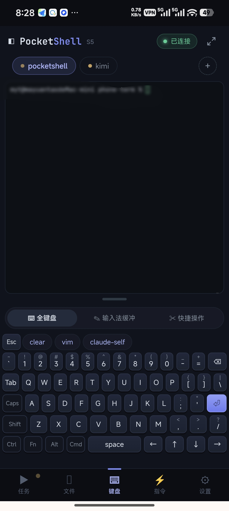
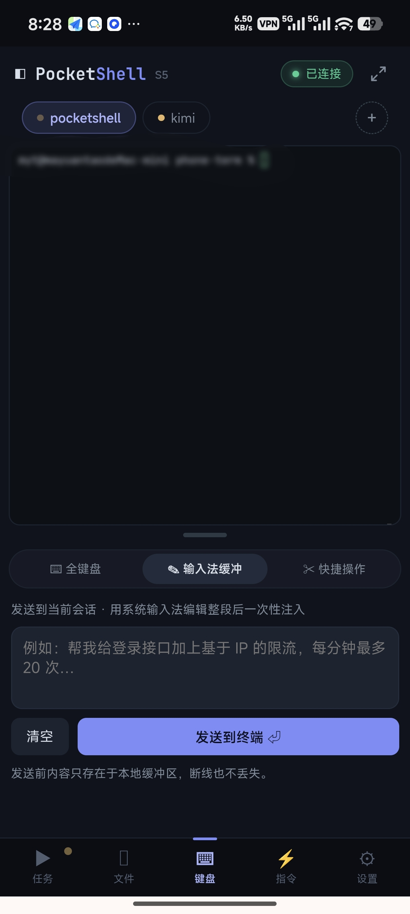
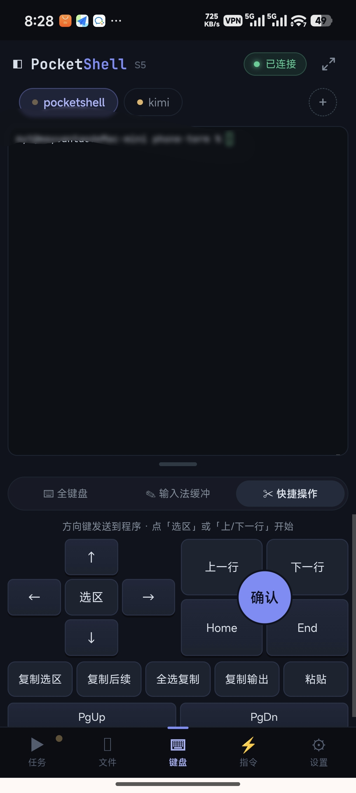
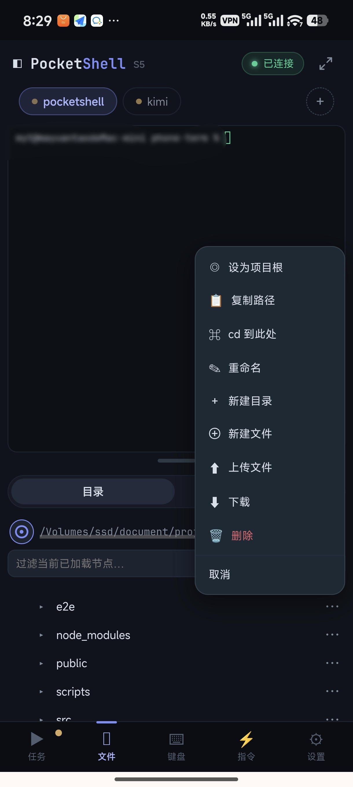
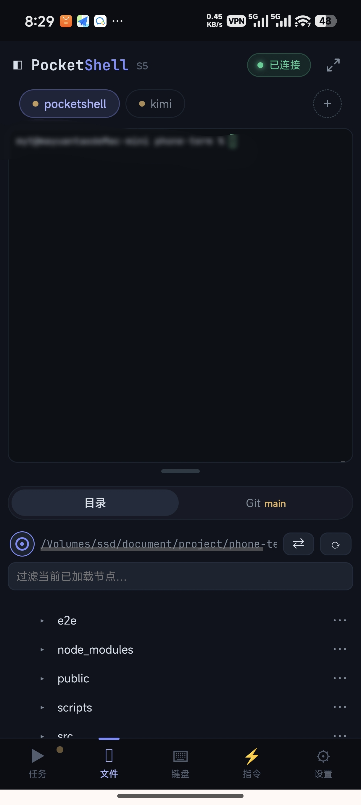
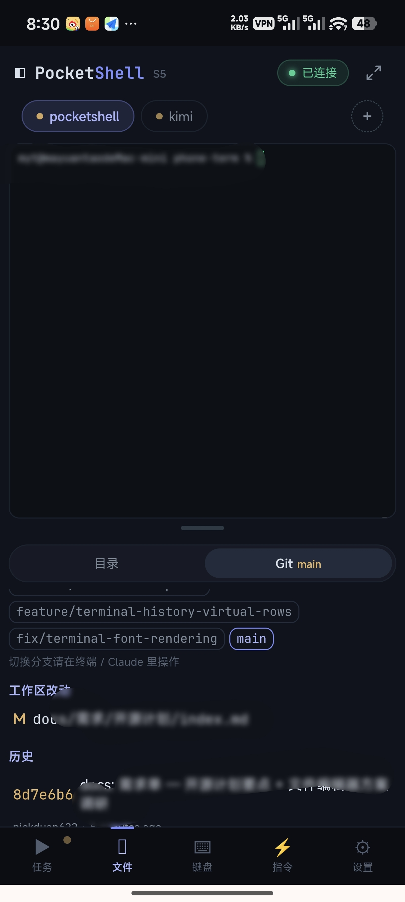
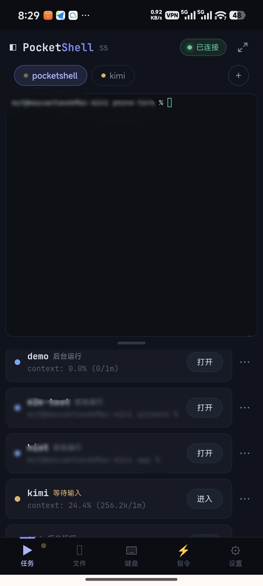
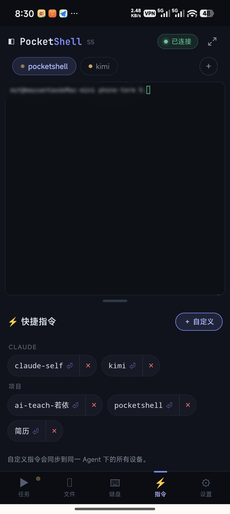
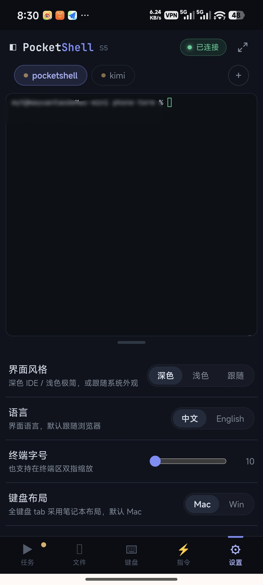
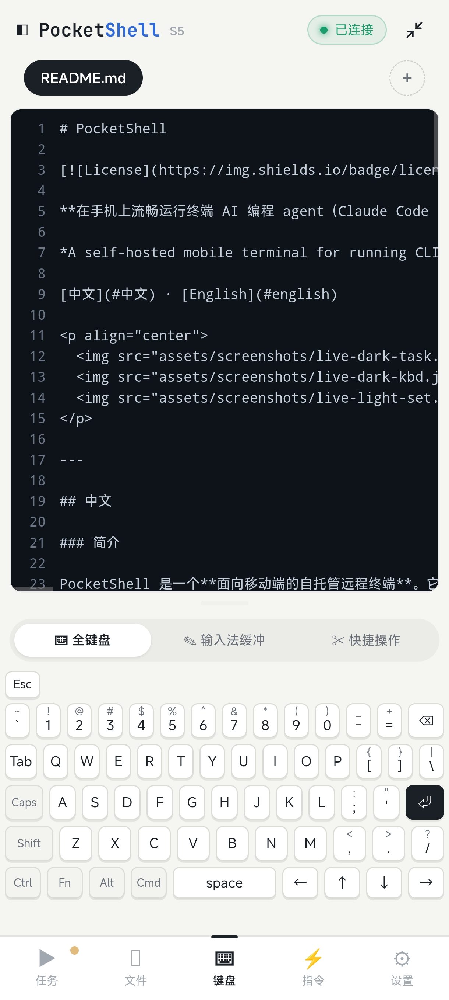

# PocketShell

[](./LICENSE)

**A self-hosted mobile terminal for running CLI/TUI coding agents (Claude Code, Codex, opencode, …) from your phone. Core feature: resilient sessions — your task keeps running server-side when the phone drops offline, and output is replayed on reconnect.**

**English** · [中文](./README-CN.md)

<p align="center">
  
  
  
</p>

<p align="center">
  
  
  
</p>

<p align="center">
  
  
  
  
</p>

---

### Overview

PocketShell is a **self-hosted mobile-first remote terminal**. It brings your dev machine's terminal sessions into a phone browser, so you can run any **CLI/TUI coding agent** (Claude Code, Codex, opencode, …) or plain shell/vim/htop anywhere.

One binary = the whole product: the frontend is embedded and served on the same port, traffic is end-to-end encrypted, and it runs on a clean machine without Bun installed.

**Core feature — resilient sessions + replay:** run an agent from your phone, drop offline mid-task, and the server-side task keeps going; on reconnect the terminal screen, scrollback and session state are replayed back into sync.

### Features

- **Multi-session terminal / server-side tmux panel** — lists every tmux session on the host (even ones this app didn't create); attach, rename, kill; three-state dots (run/wait/done) + last-line preview; a persistent terminal per session.
- **Resilient sessions + replay** — dual-signal offline detection, exponential-backoff reconnect; per-session `lastSeq` accounting replays only the gap; output keeps flowing into replay while offline.
- **End-to-end encryption & device security** — full Noise **IK** handshake per connection (mutual auth + forward secrecy); one-time in-channel pairing code; persistent device registry with naming / one-click revoke; rate limiting; structured audit log.
- **Custom full keyboard** — read-only xterm, all input routed; full laptop layout (F1–F12, arrows, sticky modifiers); Fn app-command layer; IME whole-segment input; keyboard-driven selection/copy/paste; smart command-hint bar.
- **Snippets** — built-in groups (common agent / Git / project commands) plus custom ones, tap to insert, broadcast-synced across devices.
- **File + Git panel** — lazy tree with inline git markers; code preview (highlight + line numbers) that switches to an editor (CodeMirror 6 — line numbers, find/replace, native IME, chunked save with mtime-based overwrite guard, new files open straight into the editor); **file preview: images / Markdown (rendered, with code highlight + local images) / static HTML (sandboxed iframe that runs JS + relative assets), with a persistent `Preview｜Source｜Edit` header bar + refresh**; working-tree diff; read-only git log/branches/status; file ops (rename/new/delete with confirm); upload/download (multi-file with progress, dir-as-zip, chunked transfer).
- **Mobile shell** — split top/bottom panes with a draggable divider (double-tap fullscreen); 5-tab bottom bar; unified top tab bar (terminals + files); persisted layout.
- **Dual themes** — dark IDE / light minimal, switch in settings, applied instantly.
- **Bilingual** — full i18n (zh/en), follows browser language on first open, switchable in settings.
- **PWA** — installable on mobile Chrome, standalone launch (zero-cache SW, always latest).
- **Zero-dependency distribution** — single-file binary (`bun build --compile`, linux/darwin targets); pure-JS crypto, no native addons; cross-compile all targets from one Mac.

> Tuned for full-screen TUI agents (classic-renderer switch, alt-screen scrollback normalization) so long output scrolls without limit and the input line stays pinned to the bottom.

### Interaction cheat sheet

A few mobile gestures and key combos aren't self-evident; they're collected here. In the "Icon / button" column, icon buttons show their glyph and text buttons show their label.

**Full keyboard (⌨ tab)**

| Location | Icon / button | What it does |
|---|---|---|
| Bottom-row modifiers | `Shift` `Ctrl` `Alt` `Cmd` `Fn` `Caps` | Tap cycles three states: **1 tap = one-shot** (releases after the next key) → **tap again = locked** (stays lit, keeps applying) → **3rd tap = off** |
| Any character key | Long-press | Auto-repeat while held |
| Combo | `Ctrl` + letter | Send a control char: `Ctrl+C` interrupt, `Ctrl+D` EOF, `Ctrl+Z` suspend, `Ctrl+L` clear, etc. |
| Combo | `Alt` + key | Send Meta (ESC prefix, i.e. `\x1b` + char) |
| Combo | `Shift` / `Caps` + letter | Uppercase (XOR: either one uppercases; both together cancel out) |
| Function row | after lighting `Fn` | The function row switches from the command-hint bar to `F1`–`F12` |
| Combo | `Fn` + `F1`–`F12` | Send a function key |
| Combo | `Fn` + `←` / `→` | Previous / next tab |
| Combo | `Fn` + `↑` / `↓` | Scroll the terminal up / down |
| Combo | `Fn` + `1`–`9` | Jump to the Nth tab |
| Combo | `Fn` + `N` / `D` / `F` / `C` / `R` | New session / background / toggle fullscreen / copy visible output / rename session |
| Combo | `Cmd` + `←` / `→` | Previous / next tab |
| Combo | `Cmd` + `A` / `C` / `V` | Select-all-copy / smart copy (selection if any, else visible output) / paste |
| Combo | `Cmd` + `F` / `N` / `R` / `K` | Page fullscreen / new session / rename session / clear screen |
| Function row (`Fn` off) | command-hint chip | Smart command suggestions; tap to complete / insert into the input line |
| Keycap top-right | small superscript | The character this key produces with `Shift` |

**IME buffer (✎ tab)**

| Location | Icon / button | What it does |
|---|---|---|
| Input area | text box | Compose a whole segment with the system IME; before sending it lives only in the local buffer and survives disconnects |
| Bottom-left | `Clear` | Clear the buffer |
| Bottom-right | `Send to terminal ⏎` | Inject the whole segment plus Enter; **with an empty buffer, Send = a bare Enter** (no need to switch back to the full keyboard to press Return) |

**Quick actions (✂ tab)**

| Location | Icon / button | What it does |
|---|---|---|
| Top row | `Esc` `Tab` `Del` | Send the corresponding key |
| D-pad center | `⏎` | Enter (confirm) |
| Nav keys | `Home` `End` `PgUp` `PgDn` | The matching cursor / paging keys |
| Bottom button | `Select text` | Open the copy-mode overlay to long-press and select terminal text manually |
| Bottom button | `Copy all` | Select the whole terminal and copy it to the clipboard |
| Bottom button | `Copy output` | Copy the currently visible terminal output |
| Bottom button | `Paste` | Paste the clipboard into the terminal |

**File panel (directory tab)**

| Location | Icon / button | What it does |
|---|---|---|
| Path bar, left | ◉ (ring anchor) | **Single tap**: set the project root to the focused terminal's working dir; **double tap**: toggle "follow focused terminal" (root tracks wherever the terminal `cd`s) |
| Path bar, middle | path text | Tap to copy the full path to the clipboard |
| Path bar, right | `⇄` | Switch project root (opens the root history list) |
| Path bar, right | `⟳` | Refresh the tree (keeps expanded levels) |
| Tree row, leading | `▸` / `▾` / `·` | Collapsed dir / expanded dir / file; tap a dir row to expand, a file row to open preview |
| Tree row, trailing | `⋯` | Open that item's action menu (copy path, cd, rename, new, upload, download, delete, …) |
| Tree row, inline | `M` `A` `D` `?` | git status markers: modified / added / deleted / untracked |
| Sub-tab bar | branch beside `Git` | The current git branch |

### Quick start

**Requirements**
- Host running the Agent: `tmux`, `git`.
- Build: [Bun](https://bun.sh) ≥ 1.3.

**Option A — run from source**

```bash
cd agent && bun install && bun run start     # backend (needs tmux)
cd app   && bun install && bun run dev        # frontend, http://localhost:5173
```

**Option B — download a prebuilt binary (fastest, recommended)**

Grab the archive for your platform (`linux-x64` / `linux-arm64` / `darwin-arm64` / `darwin-x64`) from [Releases](https://github.com/Big-Pony/pocketshell/releases), then extract and run:

```bash
# Linux x64 shown; swap the filename for other platforms
tar -xzf pocketshell-agent-linux-x64.tar.gz
./pocketshell-agent-linux-x64
```

Optional: verify integrity with the `SHA256SUMS.txt` shipped in the same Release (`shasum -a 256 -c SHA256SUMS.txt`). The target host only needs `tmux`. On macOS, if Gatekeeper blocks the first run, allow it under System Settings → Privacy & Security.

**Option C — build the binary from source**

```bash
cd app   && bun install && bun run build      # build embedded frontend first
cd agent && bun install && bun run build:bin  # single-file binaries, all platforms
```

Copy the binary for your platform to the target host (only `tmux` required) and run it.

**URL & default port**

The Agent listens on port **`8722`** by default (change with `POCKETSHELL_PORT`); once started, open `http://127.0.0.1:8722` in a browser on the host machine. Note it binds to `127.0.0.1` only by default — to reach it from your phone over LAN/internet, set `POCKETSHELL_HOST=0.0.0.0` plus `POCKETSHELL_ADVERTISE`, or put it behind a reverse proxy — see the [deployment guide](./DEPLOYMENT.md).

**First pairing**

On first run the Agent prints the App URL, a pasteable **pairing string**, and the Agent public key. Open the App on your phone, paste the pairing string to complete a one-time pairing (default TTL 300s). The device is trusted afterward.

**Common environment variables** (`agent/src/config.ts`; precedence env > `<keyDir>/agent.json` > default)

| Variable | Default | Purpose |
|---|---|---|
| `POCKETSHELL_HOST` | `127.0.0.1` | bind address |
| `POCKETSHELL_PORT` | `8722` | port |
| `POCKETSHELL_ADVERTISE` | — | external address baked into the pairing string |
| `POCKETSHELL_KEY_DIR` | `~/.pocketshell` | keys / devices / audit dir |
| `POCKETSHELL_TLS` / `_CERT` / `_KEY` | `0` | Agent built-in TLS (bring your own cert) |
| `POCKETSHELL_ADMIN` | on | local admin page (127.0.0.1 only), `0` to disable |

### Admin page

The Agent ships a built-in admin page restricted to **localhost only**: open `http://127.0.0.1:8722/admin` on the machine running the Agent (port follows `POCKETSHELL_PORT`; the page itself is bilingual zh/en). It lets you:

- **Generate a new pairing code** — a fresh one-time pairing string (TTL 300s) for pairing a new phone, no Agent restart needed;
- **Inspect paired devices** — name, public key, last-seen IP, online status;
- **Remove / revoke devices** — a revoked device is disconnected immediately and can no longer complete the handshake.

The admin page only answers requests from `127.0.0.1`; access via a reverse proxy or the public internet is rejected by design. Set `POCKETSHELL_ADMIN=0` to disable it entirely.

### Deployment

Need access from outside your LAN? See **[DEPLOYMENT.md](./DEPLOYMENT.md)** — it covers four setups: bare IP+port, direct server deployment behind Caddy / Nginx, Cloudflare Tunnel (no public IP needed), and an frp relay server, plus systemd / launchd service examples.

### Auto-update

The Agent has built-in in-app auto-update backed by GitHub Releases: it silently checks for a newer version on startup and again every time a phone connects (result cached 6h; a failed check never breaks normal use). When a newer version exists, an update badge appears next to the brand in the top bar; tap it to open a confirmation dialog, then tap "Update" — download, verify, (on macOS) re-sign, swap the binary, and restart all happen automatically, no manual binary handling required.

- Set `POCKETSHELL_UPDATE=0` to disable it; point `POCKETSHELL_UPDATE_REPO` at your own fork, or set it to `off` for the same effect as disabling.
- The self-restart after an in-app update relies on the process being supervisor-managed (systemd / launchd); on macOS, a Full Disk Access grant made before an update survives OTA. Details: **[DEPLOYMENT.md § Auto-update (OTA)](./DEPLOYMENT.md#auto-update-ota)**.

### Notifications

When an agent (Claude Code / Codex / opencode) finishes a work round or is waiting on your input, it can push a notification to your phone — even if the App isn't open, the phone is locked, or you're looking at a different session.

**Enabling it**: Settings → Notifications, toggle per tool (Claude Code / Codex / opencode each have their own switch). Turning one on idempotently writes a hook/notify entry into that tool's config:

- Claude Code → `~/.claude/settings.json` (`hooks.Notification`)
- Codex → `~/.codex/config.toml` (the `notify` field)
- opencode → its plugin directory (`~/.config/opencode/plugin/pocketshell-notify.js`)

Turning it off removes exactly that entry and leaves any other hooks/config you wrote by hand untouched; a failed write (JSON parse error, a conflicting existing `notify` config, opencode not installed, etc.) shows the specific reason in settings instead of failing silently.

**Two delivery channels, can both be on:**

- **Web Push** — needs to be opened from a PWA that's been "added to home screen," with notification permission granted; on iOS you must add it to the home screen first (a plain Safari tab can't receive push); on Android without Google Play Services (common in mainland China), delivery may fail since it depends on reaching FCM.
- **Outbound webhooks** — built-in templates for WeCom / Feishu (optional signing secret) / Slack / Discord, plus a custom URL + JSON template; configure any number of them, and test-send each one individually.

**Smart do-not-disturb**: if you're currently viewing a session in the foreground, its completion won't trigger a system notification (just a lightweight in-app hint); it does push once you're in the background, the screen is locked, or you're viewing a different session. Repeated completions on the same session within a short window (10s by default, adjustable) collapse into a single notification.

**Privacy note**: notifications include an agent-output summary by default — you can turn that off in settings. Web Push travels over the browser's standard encrypted channel, but **webhooks send the message in plaintext to third-party providers like WeCom/Feishu** — keep that in mind if the summary could contain sensitive output and you've configured a webhook.

### Security

Every connection performs a Noise IK handshake with mutual authentication and forward secrecy; an unregistered device never gets past the handshake, and any tunnel/proxy in between only carries ciphertext. **The auth boundary is the security boundary** — a paired device can browse files within the Agent process's own permissions (no extra sandbox), so constrain access via process permissions. In production, terminate TLS at the edge (Cloudflare/Caddy). Crypto keys live only in `KEY_DIR` and are never committed.

### Performance

Tuned for flaky mobile networks: PTY output is batched by time/size and fanned out only to subscribers with backpressure drop/recover; large RPC responses are auto-chunked and reassembled; reconnect replays only the missing gap; static assets are precompressed (br/gz) with ETag/304; hidden terminals stop writing and background tabs detach.

### License

[Apache-2.0](./LICENSE)
